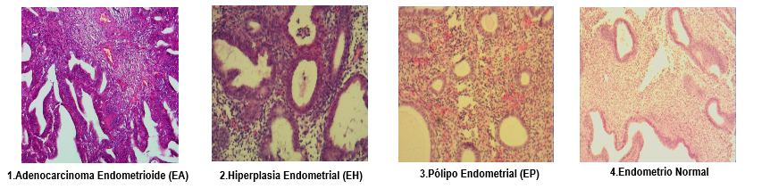
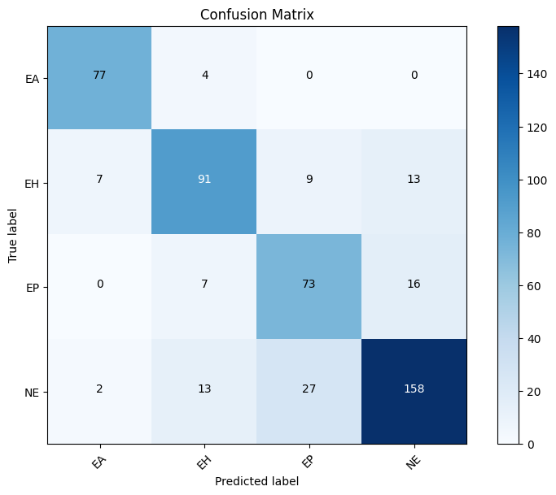
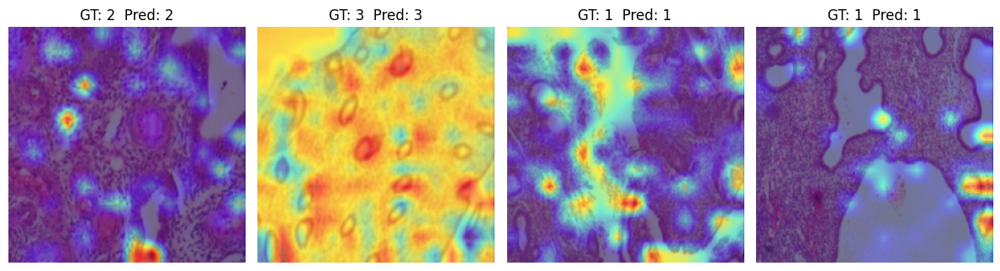

# Histopathology Image Classifier with Vision Transformers (ViT)

Este proyecto implementa un sistema de **clasificación automática de imágenes histopatológicas de cáncer de endometrio** utilizando **Vision Transformers (ViT)**.

El modelo propuesto logra un rendimiento superior frente a arquitecturas convolucionales tradicionales y redes específicas como **HIENet**, además de superar el desempeño de especialistas humanos en la misma tarea.

---

## ✨ Características principales

* **Vision Transformer (ViT)** preentrenado y ajustado para 4 clases de tejidos endometriales.
* **Transfer Learning & Fine-Tuning** en dataset histopatológico público.
* **Pipeline robusto de preprocesamiento y data augmentation estratificado**.
* **Explainable AI (XAI)**: mapas de atención para visualizar regiones diagnósticamente relevantes.
* **Comparación con estado del arte**: HIENet y expertos humanos.
* Implementación en **PyTorch** con técnicas modernas de optimización.

---
## 📊 Dataset
El conjunto de datos utilizado está disponible públicamente en [Figshare](https://figshare.com/articles/dataset/A_histopathological_image_dataset_for_endometrial_disease_diagnosis/7306361).  
Contiene **3300 imágenes histopatológicas** clasificadas en 4 categorías principales:

- `NE`: Endometrio Normal  
- `EA`: Adenocarcinoma Endometrioide  
- `EP`: Pólipo Endometrial  
- `EH`: Hiperplasia Endometrial 

---

## 🧬 Pipeline de procesamiento de imágenes

1. **Carga del dataset** (3300 imágenes en 4 clases desde [Figshare](https://figshare.com/articles/dataset/A_histopathological_image_dataset_for_endometrial_disease_diagnosis/7306361)).
2. **Preprocesamiento**:

   * Redimensionamiento a 224×224 px.
   * Normalización *Min-Max scaler* a rango \[0,1].
3. **Data Augmentation estratificado**:

   * Rotaciones, flips, traslaciones, cambios de escala, ajustes de brillo y saturación.
   * Manteniendo proporciones balanceadas entre clases.
4. **Particionamiento de datos**:

   * 70% entrenamiento – 15% validación – 15% prueba.
5. **Entrenamiento con Transfer Learning**:

   * Capa de salida adaptada a 4 clases.
   * Fine-tuning completo con regularización y scheduler coseno.
6. **Evaluación**:

   * Métricas: accuracy, precision, recall, F1-score.
   * Matriz de confusión y análisis interpretativo con XAI.

---

## ⚙️ Hiperparámetros principales

| Hiperparámetro     | Valor             |
| ------------------ | ----------------- |
| Épocas             | 10                |
| Tamaño de lote     | 32                |
| Learning Rate      | 3e-5 (0.00003)    |
| Optimizador        | AdamW             |
| Weight Decay       | 1e-4 (0.0001)     |
| Scheduler          | CosineAnnealingLR |
| Función de pérdida | CrossEntropyLoss  |
| Imagen input size  | 224×224 px        |

---

## 📊 Resultados obtenidos

El modelo **ViT** alcanzó una **accuracy del 80.28%**, con un F1-score macro de **81%**, superando tanto a HIENet como a patólogos humanos en la misma tarea.

### Métricas por clase

| Clase              | Precisión  | Sensibilidad | F1-score   |
| ------------------ | ---------- | ------------ | ---------- |
| NE                 | 84.49%     | 79.00%       | 81.65%     |
| EA                 | 89.53%     | 95.06%       | 92.21%     |
| EP                 | 66.97%     | 76.04%       | 71.21%     |
| EH                 | 79.13%     | 75.83%       | 77.44%     |
| **Promedio Macro** | **80.00%** | **81.00%**   | **81.00%** |

### Comparación con otros métodos

| Método / Investigadores       | Accuracy (%) |
| ----------------------------- | ------------ |
| Investigador 1                | 71.00        |
| Investigador 2                | 59.00        |
| Investigador 3                | 58.00        |
| **Promedio humanos**          | 62.67        |
| **HIENet (Sun et al., 2019)** | 76.91        |
| **ViT (este trabajo)**        | **80.28**    |

👉 El **ViT mejora en un +3.4% sobre HIENet** y en **+17.61% respecto al promedio humano**, confirmando el poder de los mecanismos de autoatención para capturar patrones morfológicos complejos.

---

## 📈 Ejemplos de resultados

* **Matriz de confusión** del modelo ViT:

## 🔍 Inteligencia Artificial Explicativa (XAI)

Para garantizar la interpretabilidad clínica del modelo, se integraron técnicas de IA explicativa sobre el Vision Transformer.

El método utilizado fue **Attention Rollout**, complementado con técnicas similares a Grad-CAM adaptadas a Transformers.

* **Mapas de atención (XAI)** que muestran las regiones clave en la decisión:

---

## 📚 Tecnologías

* [PyTorch](https://pytorch.org/)
* [Timm](https://github.com/huggingface/pytorch-image-models)
* [Scikit-learn](https://scikit-learn.org/)
* [Matplotlib / Seaborn](https://matplotlib.org/)

---

## 🚀 Próximos pasos

* Ampliar dataset con imágenes adicionales para clases desbalanceadas.
* Explorar arquitecturas híbridas (CNN + Transformer).

